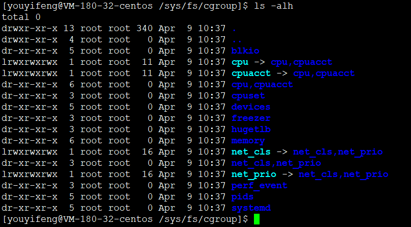

# 传统资源控制方式

## 红帽5

security_limit.so

```
# /etc/security/limits.conf
#
#This file sets the resource limits for the users logged in via PAM.
#It does not affect resource limits of the system services.
#
#Also note that configuration files in /etc/security/limits.d directory,
#which are read in alphabetical order, override the settings in this
#file in case the domain is the same or more specific.
#That means for example that setting a limit for wildcard domain here
#can be overriden with a wildcard setting in a config file in the
#subdirectory, but a user specific setting here can be overriden only
#with a user specific setting in the subdirectory.
#
#Each line describes a limit for a user in the form:
#
#<domain>        <type>  <item>  <value>
#
#Where:
#<domain> can be: 可以是用户名、组名、也可以是通配符
#        - a user name
#        - a group name, with @group syntax
#        - the wildcard *, for default entry
#        - the wildcard %, can be also used with %group syntax,
#                 for maxlogin limit
#
#<type> can have the two values:
#        - "soft" for enforcing the soft limits 软限制可以突破
#        - "hard" for enforcing hard limits 硬限制无法突破
#
#<item> can be one of the following:
#        - core - limits the core file size (KB)
#        - data - max data size (KB)
#        - fsize - maximum filesize (KB)
#        - memlock - max locked-in-memory address space (KB)
#        - nofile - max number of open file descriptors
#        - rss - max resident set size (KB)
#        - stack - max stack size (KB)
#        - cpu - max CPU time (MIN)
#        - nproc - max number of processes
#        - as - address space limit (KB)
#        - maxlogins - max number of logins for this user
#        - maxsyslogins - max number of logins on the system
#        - priority - the priority to run user process with
#        - locks - max number of file locks the user can hold
#        - sigpending - max number of pending signals
#        - msgqueue - max memory used by POSIX message queues (bytes)
#        - nice - max nice priority allowed to raise to values: [-20, 19]
#        - rtprio - max realtime priority
#
#<domain>      <type>  <item>         <value>
#

#*               soft    core            0
#*               hard    rss             10000
#@student        hard    nproc           20
#@faculty        soft    nproc           20
#@faculty        hard    nproc           50
#ftp             hard    nproc           0
#@student        -       maxlogins       4

* hard nofile 65535
* soft nofile 65535
# End of file
```

修改该配置文件，无需重启，立即生效。

例如，限制youyifeng最多打开5个文件：

```
youyifeng   hard  nofile  5
```


修改后保存退出，切换到youyifeng，登陆时报错误。
用户登录打开的文件肯定不止5个。


例如，限制youyifeng最多使用100MB内存（单位KB）

```
youyfieng hard  as 102400
```

* 修改配置立即生效，但是如果用户已经登录，则限制不会生效，需要重新登录才行
* 软限制、硬限制：默认是硬限制，但是可以修改软限制接近硬限制，但是无法超过硬限制。soft是最小，hard是最大。软限制可以调整。
* 默认配置：


## cgroup引入

* 控制组control group，由红帽6引入


* 用mount查看挂载点




```
[youyifeng@VM-180-32-centos /sys/fs/cgroup/memory]$ rpm -qa|grep libcg
libcgroup-tools-0.41-21.tl2.x86_64
libcgroup-0.41-21.tl2.x86_64
[youyifeng@VM-180-32-centos /sys/fs/cgroup/memory]$ rpm -ql libcgroup
/usr/lib64/libcgroup.so.1
/usr/lib64/libcgroup.so.1.0.41
/usr/share/doc/libcgroup-0.41
/usr/share/doc/libcgroup-0.41/COPYING
/usr/share/doc/libcgroup-0.41/README
[youyifeng@VM-180-32-centos /sys/fs/cgroup/memory]$ rpm -ql libcgroup-tools
/etc/cgconfig.conf
/etc/cgconfig.d
/etc/cgrules.conf
/etc/cgsnapshot_blacklist.conf
/etc/sysconfig/cgred
/usr/bin/cgclassify
/usr/bin/cgcreate
/usr/bin/cgdelete
/usr/bin/cgexec
/usr/bin/cgget
/usr/bin/cgset
/usr/bin/cgsnapshot
/usr/bin/lscgroup
/usr/bin/lssubsys
/usr/lib/systemd/system/cgconfig.service
/usr/lib/systemd/system/cgred.service
/usr/sbin/cgclear
/usr/sbin/cgconfigparser
/usr/sbin/cgrulesengd
/usr/share/doc/libcgroup-tools-0.41
/usr/share/doc/libcgroup-tools-0.41/COPYING
/usr/share/doc/libcgroup-tools-0.41/README
/usr/share/doc/libcgroup-tools-0.41/README_systemd
/usr/share/man/man1/cgclassify.1.gz
/usr/share/man/man1/cgclear.1.gz
/usr/share/man/man1/cgcreate.1.gz
/usr/share/man/man1/cgdelete.1.gz
/usr/share/man/man1/cgexec.1.gz
/usr/share/man/man1/cgget.1.gz
/usr/share/man/man1/cgset.1.gz
/usr/share/man/man1/cgsnapshot.1.gz
/usr/share/man/man1/lscgroup.1.gz
/usr/share/man/man1/lssubsys.1.gz
/usr/share/man/man5/cgconfig.conf.5.gz
/usr/share/man/man5/cgred.conf.5.gz
/usr/share/man/man5/cgrules.conf.5.gz
/usr/share/man/man8/cgconfigparser.8.gz
/usr/share/man/man8/cgrulesengd.8.gz
```

* /etc/cgconfig.conf 是配置文件，```man /etc/cgconfig.conf```查看配置文件帮助
* /etc/cgrules.conf 是传统/etc/security/limits.conf替代，属于策略控制

```
service cgred status
service cgroup status
```


---
